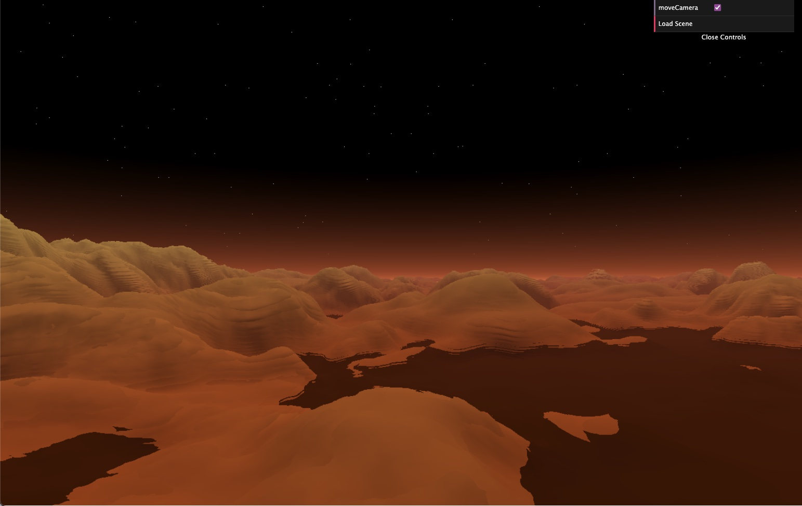
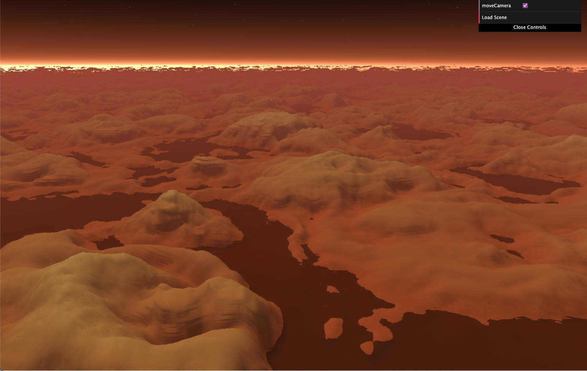
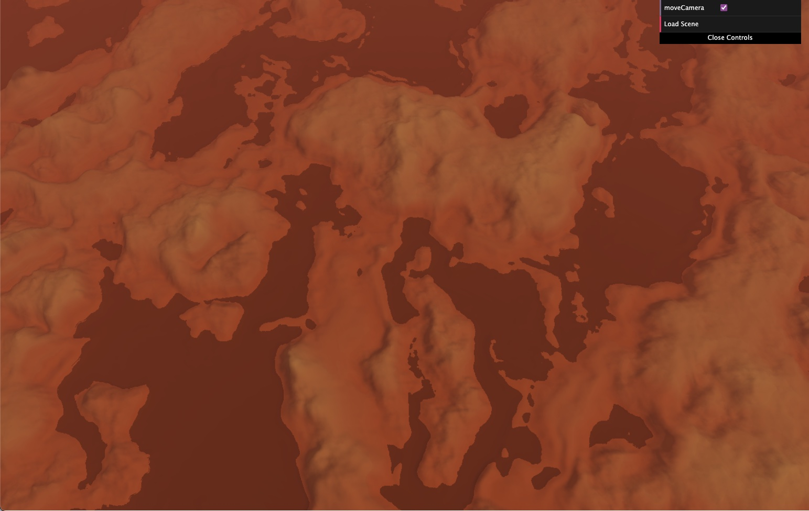

# Project 2: SDFs

[Live Demo](https://ess-aar.github.io/CIS5660-hw02-landscape)

For this project the idea was to create an alien canyon-like landscape. The terrain is created using FBM and perturbed (using rotation) FBM with a color gradient. The background is just some scattered light effect inspired from a cool shadertoy (linked below) with some stars. To add interest in the scene I chose to animate the water to look like it ebbs & flows. There are 3 lights in the scene: the key light is near the horizon, the fake illumination light is opposite the key light & the fill light is right at the top. Also, I added some reddish hue distance fog.

There is much I would still like to work on & fix for this project. The artifacts on the terrain give it a more canyon-like look, but I would like to fix the artifacts where it joins the water which becomes very obvious as it animated. I would also like to send more time tweaking the lighting in the scene to create more depth.

Noise used: 2D FBM, Rotated 2D FBM

Toolbox functions used: Linear Interpolation, Cosine Interpolation, Sin waves, Re-mapping function

### Parameters

Following parameters are exposed:

- Move Camera: toggle to use mouse input to move camera around

### References
- CIS 5660 Noise, Toolbox Function material
- CIS 5660 Lab material
- [Ray Marching Terrains](https://iquilezles.org/articles/terrainmarching/)
- [Fog](https://iquilezles.org/articles/fog/)
- [Sirenian Dawn](https://www.shadertoy.com/view/XsyGWV)
- [The Book of Shaders](https://thebookofshaders.com/13/)

## Objective

Practice using raymarching, SDFs, and toolbox functions to sculpt a *beautiful* 3d landscape. 

## Set up your raymarcher

* Starting with the base code, create a ray marcher that can accurately render 3d shapes. We recommend testing with a sphere at the center of your canvas
* Add normal computation to properly shade your geometry. Start with lambert shading
* Add basic raymarching optimizations: use sphere-tracing, limit the number of maximum steps to avoid infinite loop

## Add basic scene elements

Using what you've learned about toolbox functions and sdfs:
* Create a noise-based terrain with height-based coloration that suggests at least 3 distinct terrain features (for example, the lowest portions of your terrain can be water and the highest, white-colored icecaps.). Feel free to get creative and do a non-realistic or stylized scene.
    * You must use at least 3 different toolbox functions, such as bias/gain or a wave function. At this point we expect you to be comfy using such functions to modify shape.
* Create a backdrop / sky where there is no terrain. For example, an interesting gradient with some kind of noise.

## Lighting

* Using the 3-point lighting system (fill light, key light, and fake global illumination light), light your scene to bring it to life.

## Animation
Add some element of animation to your scene that ISN'T just changing terrain height. (Been there done that with the fireball!)

Suggestions:
* Animate the position of your lighting / sun to simulate a change in time of day. We recommend the sky change color in step with your lighting change.
* Animate the thresholds for different terrain features, to suggest rising tides, or melting ice-caps, or a seasonal change in foliage color. 
* If you elect to add clouds, animate the cloud positions to suggest wind.

## (Optional) Extra Credit

* Additional scene elements eg. a building or animal or trees. [easy-hard, depends]
   * Sculpting with sdfs can be fiddly, so trying to model something very precise may be frustrating. We suggest keeping it simple
   * If your models get heavy you may also need to add acceleration structures *bonus points!
* Add 3d translucent clouds to your sky. [hard, it will be fiddly and slow your program down A LOT]
* Add camera animation to create a fly-over effect [???]
   * Depending on how you set up your scene, this may be a pretty involved change because the terrain will have to look good EVERYWHERE not just at a fixed angle. #proceduralLessons).

## Submission

- Update README.md to contain a solid description of your project
- Publish your project to gh-pages. `npm run deploy`. It should now be visible at http://username.github.io/repo-name
- Create a [pull request](https://help.github.com/articles/creating-a-pull-request/) to this repository, and in the comment, include a link to your published project.
- Submit the link to your pull request on Canvas.
