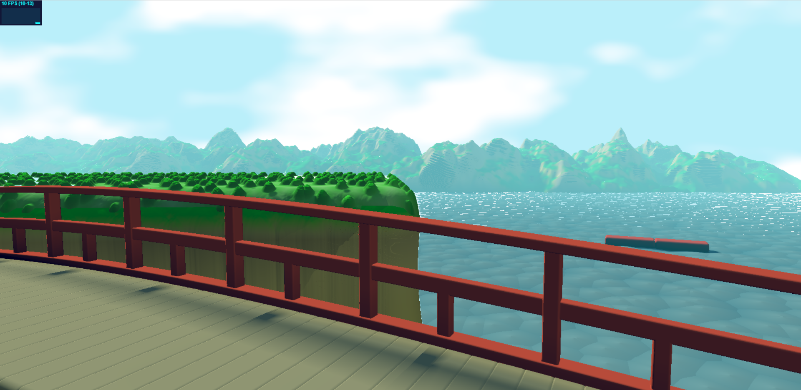

# Project 2: SDFs

# Ghibli Landscape

   

For this assignment, I drew inspiration from Studio Ghibli's landscapes. Some of my favorite locations are the [bridge from Spirited Away](https://www.ghibli.jp/works/chihiro/#frame&gid=1&pid=20) and the mountains from Howl's Moving Castle, so I decided to create a mix of both. The bridge is modeled with 6 rounded boxes and uses a `mod` operation to infinitely repeat each piece. Additionally, I modified the bridge's `y` height to create a gentle sloping effect. The cliff is modeled with a rounded box, with offsets based on `sin` and `cos` in the x and z directions to create striations on the sides. The vegetation on top is a box displaced by Worley noise, which creates the small bushes. I originally wanted to have much bigger trees on the cliff with varied colors, but it was tricky getting the placement right. The mountains in the background are also created from a rounded box since I wanted more control over the exact positioning. The surface is heavily distorted with `FBM` and the `roundness` factor for the SDF was set to a high value. The water is based on Worley noise that is animated over time. An extra bonus is that there are some small gaps in the water due to the raymarching that actually creates the feeling of specular highlights on the water. 

In Spirited Away, there is a train that moves through the water. I decided to add this in as a small animation and used `mod` to have it repeat. With more time, I would like to add more detail to the train colors to help distinguish its different parts. I also think it would be fun to create a painterly effect for the background and a toon effect for the foreground, much like the movies. Besides more fine tuning with the SDFs, I would also like to spend more time on optimization. I added bounding boxes for the mountains and cliff as well as a check to help skip empty space, but unfortunately it still runs at 10-12 FPS on my machine. Overall, I had a lot of fun with this project!

### Live Demo

See it [here](https://meganr28.github.io/hw02-landscape/)!

### Features

* Basic raymarcher with sphere tracing and max step limitation
* Normal computation
* Soft-shadowing
* Noise-based terrain
* Sky with FBM clouds
* 3-point lighting (fill, key, global illumination)
* Animation - water, clouds, train
* Optimizations (bounding boxes, ray length check) 
* Extra scene elements - bridge, train

### Toolbox Functions

These functions came in handy during this assignment:

* `smoothstep` - remapping noise values, color correction, and clouds
* `sin` and `cos` - used for modeling many objects, such as the bridge and the cliff
* `bias` - remapping color values

### References and Inspiration

* Inigo Quilez, [Distance Functions](https://iquilezles.org/articles/distfunctions/)
* Inigo Quilez, [Soft Shadows in Raymarched SDFs](https://iquilezles.org/articles/rmshadows/)
* Inigo Quilez, [Painting a Landscape with Maths](https://www.youtube.com/watch?v=BFld4EBO2RE)
* UPenn CIS 560 Course Notes - Noise Functions
* UPenn CIS 566 Course Notes - Implicit Surfaces

## Objective

Practice using raymarching, SDFs, and toolbox functions to sculpt a *beautiful* 3d landscape. 

## Set up your raymarcher

* Starting with the base code, create a ray marcher that can accurately render 3d shapes. We recommend testing with a sphere at the center of your canvas
* Add normal computation to properly shade your geometry. Start with lambert shading
* Add basic raymarching optimizations: use sphere-tracing, limit the number of maximum steps to avoid infinite loop

## Add basic scene elements

Using what you've learned about toolbox functions and sdfs:
* Create a noise-based terrain with height-based coloration that suggests at least 3 distinct terrain features (for example, the lowest portions of your terrain can be water and the highest, white-colored icecaps.). Feel free to get creative and do a non-realistic or stylized scene.
    * You must use at least 3 different toolbox functions, such as bias/gain or a wave function. At this point we expect you to be comfy using such functions to modify shape.
* Create a backdrop / sky where there is no terrain. For example, an interesting gradient with some kind of noise.

## Lighting

* Using the 3-point lighting system (fill light, key light, and fake global illumination light), light your scene to bring it to life.

## Animation
Add some element of animation to your scene that ISN'T just changing terrain height. (Been there done that with the fireball!)

Suggestions:
* Animate the position of your lighting / sun to simulate a change in time of day. We recommend the sky change color in step with your lighting change.
* Animate the thresholds for different terrain features, to suggest rising tides, or melting ice-caps, or a seasonal change in foliage color. 
* If you elect to add clouds, animate the cloud positions to suggest wind.

## (Optional) Extra Credit

* Additional scene elements eg. a building or animal or trees. [easy-hard, depends]
   * Sculpting with sdfs can be fiddly, so trying to model something very precise may be frustrating. We suggest keeping it simple
   * If your models get heavy you may also need to add acceleration structures *bonus points!
* Add 3d translucent clouds to your sky. [hard, it will be fiddly and slow your program down A LOT]
* Add camera animation to create a fly-over effect [???]
   * Depending on how you set up your scene, this may be a pretty involved change because the terrain will have to look good EVERYWHERE not just at a fixed angle. #proceduralLessons).

## Submission

- Update README.md to contain a solid description of your project
- Publish your project to gh-pages. `npm run deploy`. It should now be visible at http://username.github.io/repo-name
- Create a [pull request](https://help.github.com/articles/creating-a-pull-request/) to this repository, and in the comment, include a link to your published project.
- Submit the link to your pull request on Canvas.
