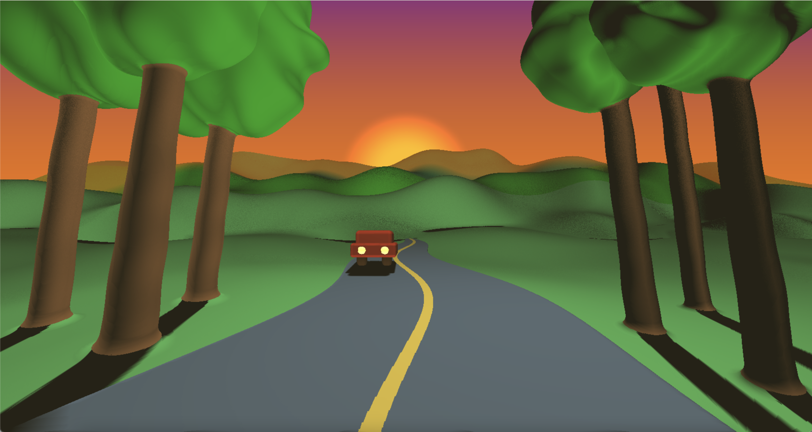
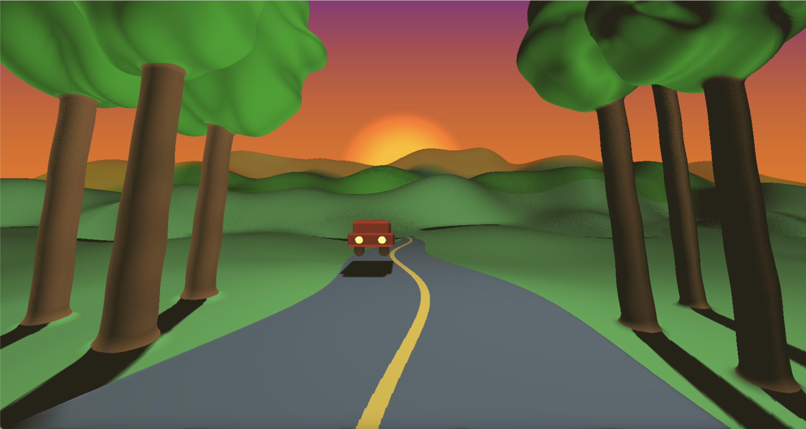

# Project 2: SDFs

## Objective

Practice using raymarching, SDFs, and toolbox functions to sculpt a *beautiful* 3d landscape. 

## Demo
Live Demo: https://vivienldy.github.io/hw02-landscape/

Mountain: I used 2D perlin noise to modified height of the mountain. And I change the scaler of the noise added base on the distance of the mountain.

Tree: My first attemp was to create the canopy with several smooth union shperes, and it was super slow (although it's still slow now...) So, I simply changed the canopy to one shpere with noise added, and it looks okay. The tree trunk is just cone with sine function noise so it won't look too stiff.

Road: Road is quad with sine function noise added. I played around with the frequency and offset to create a better winding road.

Car: Union of several basic 3D shapes.

Sun and Sky: Sun is a 2D circle SDF. And the gradient sky is colored base on the uv coordinate.

Distance fog and Soft Shadow: I mix the fog color and scene color with the smoothstep distance. And I only cast shadow to the plain terrain.

Reference: https://iquilezles.org/articles/distfunctions/ (Thank youuuu IQ!!)

### Bloopers
**BUMPING CAR**

**TOO MUCH FOG**

**MY FIRST CUTE SLOW TREE AND REFERENCE**

## Set up your raymarcher

* Starting with the base code, create a ray marcher that can accurately render 3d shapes. We recommend testing with a sphere at the center of your canvas
* Add normal computation to properly shade your geometry. Start with lambert shading
* Add basic raymarching optimizations: use sphere-tracing, limit the number of maximum steps to avoid infinite loop

## Add basic scene elements

Using what you've learned about toolbox functions and sdfs:
* Create a noise-based terrain with height-based coloration that suggests at least 3 distinct terrain features (for example, the lowest portions of your terrain can be water and the highest, white-colored icecaps.). Feel free to get creative and do a non-realistic or stylized scene.
    * You must use at least 3 different toolbox functions, such as bias/gain or a wave function. At this point we expect you to be comfy using such functions to modify shape.
* Create a backdrop / sky where there is no terrain. For example, an interesting gradient with some kind of noise.

## Lighting

* Using the 3-point lighting system (fill light, key light, and fake global illumination light), light your scene to bring it to life.

## Animation
Add some element of animation to your scene that ISN'T just changing terrain height. (Been there done that with the fireball!)

Suggestions:
* Animate the position of your lighting / sun to simulate a change in time of day. We recommend the sky change color in step with your lighting change.
* Animate the thresholds for different terrain features, to suggest rising tides, or melting ice-caps, or a seasonal change in foliage color. 
* If you elect to add clouds, animate the cloud positions to suggest wind.

## (Optional) Extra Credit

* Additional scene elements eg. a building or animal or trees. [easy-hard, depends]
   * Sculpting with sdfs can be fiddly, so trying to model something very precise may be frustrating. We suggest keeping it simple
   * If your models get heavy you may also need to add acceleration structures *bonus points!
* Add 3d translucent clouds to your sky. [hard, it will be fiddly and slow your program down A LOT]
* Add camera animation to create a fly-over effect [???]
   * Depending on how you set up your scene, this may be a pretty involved change because the terrain will have to look good EVERYWHERE not just at a fixed angle. #proceduralLessons).

## Submission

- Update README.md to contain a solid description of your project
- Publish your project to gh-pages. `npm run deploy`. It should now be visible at http://username.github.io/repo-name
- Create a [pull request](https://help.github.com/articles/creating-a-pull-request/) to this repository, and in the comment, include a link to your published project.
- Submit the link to your pull request on Canvas.
