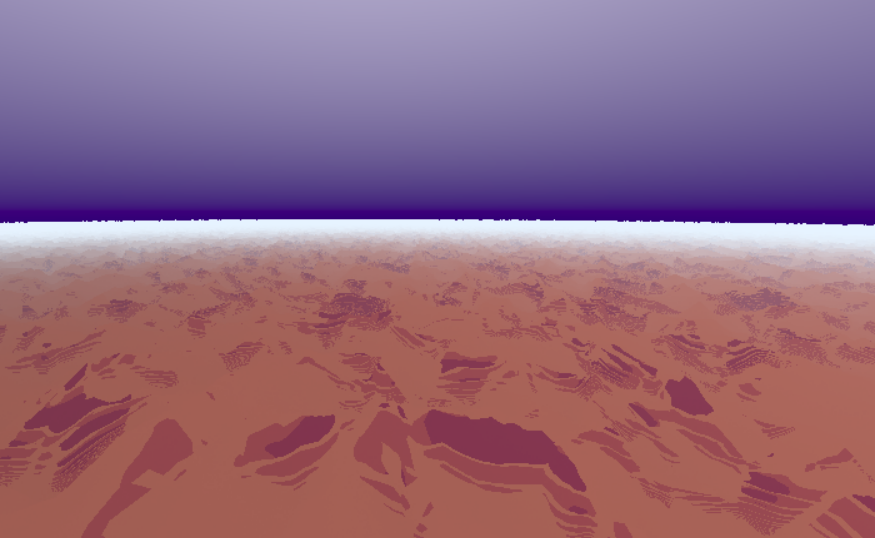

# Project 2: SDFs

https://viviviantung.github.io/hw02-landscape/

This project was a little bit of a journey for me. This past week has been overwhelming and stressful, and I put in as much time and effort as I was able to. I was still able to learn a lot through this project, and although there were things I wish I could figure out and continue working on, I am proud of what I was able to create in the time period I gave myself.

So first, I created a raymarcher using the code provided in class. I defined the max marching steps, as well as the minimum and maximum distance of marching. I then created an SDF sphere and painted it red. I used this tutorial https://jamie-wong.com/2016/07/15/ray-marching-signed-distance-functions/ to help me get started.

After that, I continued following the tutorial to create a sphere using phong light contibution and illumination. I used the wikipedia page of phong lighting to help write the functions. I also made the lights move using a cosine function.

After this is when I got really confused. I was very stuck on how to create a terrain, since all I knew was how to make SDFs show up on the screen. I didn't really understand how to deform the mesh. But then I looked up https://iquilezles.org/articles/terrainmarching/ to figure out how to get it to work. I found a polyfbm noise that seemed cool on shadertoy (https://www.shadertoy.com/view/lsySRc, https://www.shadertoy.com/view/ldGSzc), and I implemented it into my code. Thus, I created a height displacement function to utilize this noise to displace a plane SDF. I also multiplied it by a cosine function so that the displacement changed over time.

I never wanted to create a realistic scene. I was at first aiming for a lofi-style neighborhood scene, but after having the default values being orangey, I started thinking about an old west theme or a mars extraterrestrial theme haha.

I also created the lights (https://learnopengl.com/Advanced-Lighting/SSAO), creating a normal key light, an ambient light, a diffuse light, a back light, and a specular light. I moved the lights using a cosine function so that at certain times, my terrain is completely dark. I then ended up changing the sky background so that when the terrain is dark, the sky is dark as well. I then tried to incorporate ambient occlusion, as well as soft shadows, but the shadows looked really ugly to me and took away from the vibe I felt like I was going for, so I ended up commenting it out.

My next issue was then trying to change the color of the noise based on its height. When I first tried to implement it, no matter what I did, the height of the terrain seemed to stay at 50. However, then I realized I had manually set that value in my height displacement function, so once I changed that value to the noise function as well, everything seemed to work fine. I chose my colors through a color pallete generator. I also really liked the stripey pattern that the colors made in the terrain, so I'm generally okay with how the terrain turned out.

I also tried to put noise in the sky, since that was part of the instructions. Currently, I have perlin noise in the background. I don't really like how it works during the daytime, but in the night cycle, I like how the black bleeds into the other colors. If I have time, I want to blend worley with the perlin to make the sky more cloudy, but honestly I also like the sky without any noise. I feel like it fits the vibe better. 

I also tried to figure out how to add other SDFs into the screen, but whenever I did, it would create the shape behind me, no matter how I translated it. I was really confused, and then I discovered that my camera was weird, because whenever I attempted to rotate my screen, the terrain wouldn't rotate. So then I implemented the u_Ref and u_Up uniform variables into the fragment shader, and manipulated them to find the forward and the right vector of the camera. Now, the camera seems to rotate correctly, but the controls are really sensitive, so I wouldn't reccommend doing it.

I added some SDF shapes and operations that I think work because I tested it be taking out my terrain and creating the shapes using the union operation, but they always are created behind the camera and I was unable to figure it out. 

TLDR, although I'm not completely satisfied with my terrain and I really wish I could add building shapes into my scene, I'm proud of what I was able to learn through this project and how this project was able to allow me to get more experience with SDFs and ray marching. I just wish I had more time to experiment more with the different aspects of this project.

## Objective

Practice using raymarching, SDFs, and toolbox functions to sculpt a *beautiful* 3d landscape. 

## Set up your raymarcher

* Starting with the base code, create a ray marcher that can accurately render 3d shapes. We recommend testing with a sphere at the center of your canvas
* Add normal computation to properly shade your geometry. Start with lambert shading
* Add basic raymarching optimizations: use sphere-tracing, limit the number of maximum steps to avoid infinite loop

## Add basic scene elements

Using what you've learned about toolbox functions and sdfs:
* Create a noise-based terrain with height-based coloration that suggests at least 3 distinct terrain features (for example, the lowest portions of your terrain can be water and the highest, white-colored icecaps.). Feel free to get creative and do a non-realistic or stylized scene.
    * You must use at least 3 different toolbox functions, such as bias/gain or a wave function. At this point we expect you to be comfy using such functions to modify shape.
* Create a backdrop / sky where there is no terrain. For example, an interesting gradient with some kind of noise.

## Lighting

* Using the 3-point lighting system (fill light, key light, and fake global illumination light), light your scene to bring it to life.

## Animation
Add some element of animation to your scene that ISN'T just changing terrain height. (Been there done that with the fireball!)

Suggestions:
* Animate the position of your lighting / sun to simulate a change in time of day. We recommend the sky change color in step with your lighting change.
* Animate the thresholds for different terrain features, to suggest rising tides, or melting ice-caps, or a seasonal change in foliage color. 
* If you elect to add clouds, animate the cloud positions to suggest wind.

## (Optional) Extra Credit

* Additional scene elements eg. a building or animal or trees. [easy-hard, depends]
   * Sculpting with sdfs can be fiddly, so trying to model something very precise may be frustrating. We suggest keeping it simple
   * If your models get heavy you may also need to add acceleration structures *bonus points!
* Add 3d translucent clouds to your sky. [hard, it will be fiddly and slow your program down A LOT]
* Add camera animation to create a fly-over effect [???]
   * Depending on how you set up your scene, this may be a pretty involved change because the terrain will have to look good EVERYWHERE not just at a fixed angle. #proceduralLessons).

## Submission

- Update README.md to contain a solid description of your project
- Publish your project to gh-pages. `npm run deploy`. It should now be visible at http://username.github.io/repo-name
- Create a [pull request](https://help.github.com/articles/creating-a-pull-request/) to this repository, and in the comment, include a link to your published project.
- Submit the link to your pull request on Canvas.
