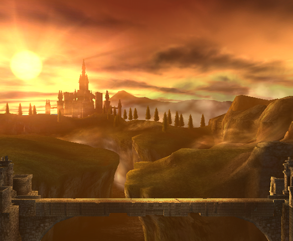

# Project 2: SDFs

For my SDF terrain project, I decided to try modeling the sunset landscape of Hyrule Field
from the Nintendo game The Legend of Zelda: Twilight Princess. While not my favorite
Zelda game, the artstyle of the near 20-year old game and its excessive use of bloom
have always inspired me visually.

Everything in the project is done without textures or meshes, all SDF and noise. This is
also why it runs so slow, as the SDF calculations with noise based deformations cause it to
chug a lot. I made some optimizations, like a bounding sphere check for the castle and
seperating out the objects into seperate renderpasses, but it still is quite slow in
full screen mode. For the multiple render passes, I simply had to make sure to enable alpha
and blend, and then set alpha level of output of shader to 1.0 if it hit a surface, and 0.0
if not. The one downside is this limits the amount of interaction between layers of the
environment, the largest one being the water not obfuscating parts of the terrain when it deforms.

The bridge, castle, and trees were hand sculpted using SDFs. I would have liked to have made them
a lot more polished, but I did not have enough time. I utilized the destructive distorion
that comes with too much noise in SDFs to get the broken look of the bridge.
The trees sway a bit with the wind over time. 

The sky and sun are also procedurally generated. I used mixtures of cosine color palettes 
to achieve the warm orange glow with a fade to pinkish on the right, as well as the intensity
of the sun.

I used a mixture of three point lighting and distance fog to actually light the terrain.
For the mountains, I also modified the alpha channel respective to distance to the sun to fake
a sort of bloom effect of light shining through the mountains.

The river is worley noise and trig-based water flow.

I used the *bias*, *gain*, *smoothstep*, and *trig* toolbox functions.

For reference, I used the areas' appearances in three
versions: the original 2006 version, the Super Smash Bros. Brawl version from 2008, and the
Super Smash Bros. Ultimate version from 2018.

*Super Smash Bros. Brawl (2008)* \
*Nintendo*\
*Courtesy of [Zelda Wiki](https://zelda.fandom.com/wiki/Bridge_of_Eldin)*

*The Legend of Zelda: Twilight Princess (2006)*\
*Nintendo*\
*Courtesy of [noclip](https://noclip.website/)*

*Super Smash Bros. Ultimate (2018)*\
*Nintendo*\
*Courtesy of [VGGTS World](https://www.vggts.gdn/where/ssbu/spiritsnaps/Spirit%20info%20-%20Midna2.jpg)*

## Objective

Practice using raymarching, SDFs, and toolbox functions to sculpt a *beautiful* 3d landscape. 

## Set up your raymarcher

* Starting with the base code, create a ray marcher that can accurately render 3d shapes. We recommend testing with a sphere at the center of your canvas
* Add normal computation to properly shade your geometry. Start with lambert shading
* Add basic raymarching optimizations: use sphere-tracing, limit the number of maximum steps to avoid infinite loop

## Add basic scene elements

Using what you've learned about toolbox functions and sdfs:
* Create a noise-based terrain with height-based coloration that suggests at least 3 distinct terrain features (for example, the lowest portions of your terrain can be water and the highest, white-colored icecaps.). Feel free to get creative and do a non-realistic or stylized scene.
    * You must use at least 3 different toolbox functions, such as bias/gain or a wave function. At this point we expect you to be comfy using such functions to modify shape.
* Create a backdrop / sky where there is no terrain. For example, an interesting gradient with some kind of noise.

## Lighting

* Using the 3-point lighting system (fill light, key light, and fake global illumination light), light your scene to bring it to life.

## Animation
Add some element of animation to your scene that ISN'T just changing terrain height. (Been there done that with the fireball!)

Suggestions:
* Animate the position of your lighting / sun to simulate a change in time of day. We recommend the sky change color in step with your lighting change.
* Animate the thresholds for different terrain features, to suggest rising tides, or melting ice-caps, or a seasonal change in foliage color. 
* If you elect to add clouds, animate the cloud positions to suggest wind.

## (Optional) Extra Credit

* Additional scene elements eg. a building or animal or trees. [easy-hard, depends]
   * Sculpting with sdfs can be fiddly, so trying to model something very precise may be frustrating. We suggest keeping it simple
   * If your models get heavy you may also need to add acceleration structures *bonus points!
* Add 3d translucent clouds to your sky. [hard, it will be fiddly and slow your program down A LOT]
* Add camera animation to create a fly-over effect [???]
   * Depending on how you set up your scene, this may be a pretty involved change because the terrain will have to look good EVERYWHERE not just at a fixed angle. #proceduralLessons).

## Submission

- Update README.md to contain a solid description of your project
- Publish your project to gh-pages. `npm run deploy`. It should now be visible at http://username.github.io/repo-name
- Create a [pull request](https://help.github.com/articles/creating-a-pull-request/) to this repository, and in the comment, include a link to your published project.
- Submit the link to your pull request on Canvas.
